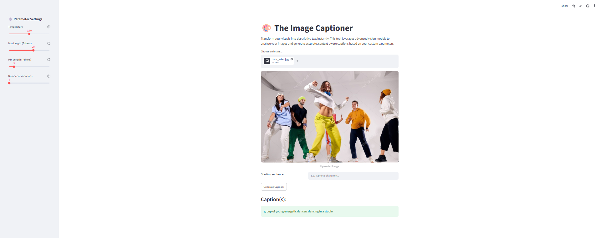

# BLIP Image Captioning

An interactive web application that generates natural language captions for uploaded images using the **BLIP (Bootstrapping Language-Image Pre-training)** vision-language model. The application provides a simple interface for image captioning while allowing users to customize the text generation process through adjustable decoding parameters.

---

## Project Overview

Image captioning is a multimodal AI task that combines **Computer Vision** and **Natural Language Processing (NLP)** to automatically generate descriptive text for an image.

This project utilizes Salesforce's **BLIP (Bootstrapping Language-Image Pre-training)** model through the Hugging Face Transformers library and deploys it as an interactive **Streamlit** application.

Users can upload an image, optionally provide a starting prompt, adjust generation parameters, and generate one or multiple caption variations in real time.

---

## Features

- Upload JPG, JPEG, or PNG images
- Generate descriptive captions using the pretrained BLIP model
- Optional prompt-based caption generation
- Adjustable decoding parameters:
  - Temperature
  - Maximum caption length
  - Minimum caption length
  - Number of generated variations
- Interactive Streamlit interface
- Fast inference using Hugging Face Transformers

---

## Demo




---

## Application Workflow

```text
User Uploads Image
        │
        ▼
Image Preprocessing
        │
        ▼
BLIP Processor
(Image Encoding & Tokenization)
        │
        ▼
BLIP Captioning Model
        │
        ▼
Caption Generation
(Custom Decoding Parameters)
        │
        ▼
Generated Caption(s)
        │
        ▼
Displayed in Streamlit Interface
```

---

## Technologies Used

| Category | Technologies |
|-----------|--------------|
| Programming Language | Python |
| Transformers | Hugging Face Transformers |
| Vision-Language Model | BLIP (Salesforce) |
| Web Framework | Streamlit |
| Image Processing | Pillow |
| Numerical Computing | NumPy |

---

## Repository Structure

```text
BLIP-Image-Captioning/
│
├── app.py
├── requirements.txt
├── README.md
├── .gitignore
└── images/
    └── demo.png
```

---

## Installation

Clone the repository

```bash
git clone https://github.com/salihdmrz1/blip-image-captioning.git
```

Navigate to the project directory

```bash
cd blip-image-captioning
```

Install the required dependencies

```bash
pip install -r requirements.txt
```

Run the Streamlit application

```bash
streamlit run app.py
```

The BLIP model will be downloaded automatically from Hugging Face the first time the application is executed.

---

## Usage

1. Launch the Streamlit application.
2. Upload an image.
3. (Optional) Provide a starting prompt.
4. Adjust the caption generation parameters.
5. Click **Generate Caption**.
6. Review one or more generated caption variations.

---

## Model

This application uses the pretrained

**Salesforce/blip-image-captioning-base**

model available through the Hugging Face Transformers library.

BLIP is a vision-language model capable of generating natural language descriptions by jointly understanding visual and textual information.

---

## Future Improvements

Potential extensions for this project include:

- Support for beam search decoding
- GPU inference acceleration
- Caption confidence estimation
- Batch image captioning
- Image caption history
- Deployment on Streamlit Community Cloud or Hugging Face Spaces

---

## Acknowledgements

- Salesforce Research for the BLIP model
- Hugging Face Transformers
- Streamlit

---

## License

There is no license for this app as this project is developed for educational and research purposes.
